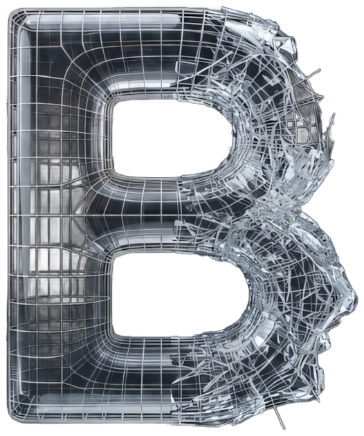
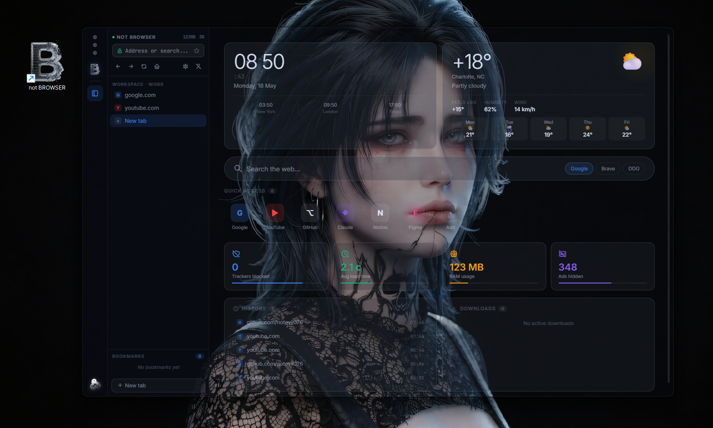

<div align="center">



# not BROWSER

**Minimal web browser built on Tauri 2**

A lightweight, privacy-first browser for Windows with a custom new tab experience.
Native speed, web-tech frontend, zero bloat.

`Rust` `Tauri 2` `TypeScript` `Vite` `HTML/CSS`

---

</div>

<br/>

## Overview

not BROWSER is a custom web browser built on Tauri 2 — Rust backend with a Chromium-based webview. It's not trying to compete with Chrome or Firefox. It's built for people who want a fast, clean, distraction-free browser with a new tab page that's actually useful.

The entire interface follows the **not** design language: dark glass morphism, violet accents, and nothing you don't need.

<br/>

## Screenshot

<div align="center">

</div>

<br/>

## Features

### New Tab Experience
— **Live clock** with seconds, date display
— **Weather widget** — current temperature, conditions, 5-day forecast
— **World clocks** — multiple timezone display (New York, London, Tokyo)
— **Search bar** with engine switcher: Google, Brave Search, DuckDuckGo

### Quick Access
— **Pinned sites** — Google, YouTube, GitHub, Claude, Notion, Figma
— **Add your own** shortcuts with custom icons
— Workspace-aware — different quick access per workspace

### Workspaces
— **Tab grouping by context** — separate workspaces for Work, Personal, Dev
— Switch between workspaces without losing state
— Sidebar with workspace list and tab management

### Privacy & Performance
— **Built-in tracker blocking** — counter displayed on new tab
— **Ad blocking** — hidden ads counter
— **RAM usage** display — see exactly what the browser consumes
— **Average load time** monitoring per session

### Interface
— Tauri 2 native window with custom title bar
— Sidebar with bookmarks, history, downloads panel
— Compact tab bar with workspace indicator
— Full glassmorphism UI on dark background

<br/>

## Architecture

```
┌─────────────────────────────────────────┐
│  not BROWSER                             │
│                                           │
│  ┌─────────────┐     ┌────────────────┐  │
│  │  Tauri Core  │     │   Frontend     │  │
│  │  (Rust)      │◄───►│   Vite + TS    │  │
│  │              │     │   HTML/CSS     │  │
│  └──────┬──────┘     └────────────────┘  │
│         │                                 │
│  ┌──────▼──────┐                          │
│  │  Webview2    │   Custom New Tab         │
│  │  (Chromium)  │   Weather API            │
│  │              │   Workspace State        │
│  └─────────────┘                          │
└─────────────────────────────────────────┘
```

<br/>

## Tech Stack

| Component | Technology |
|:---|:---|
| **Runtime** | Tauri 2 (Rust + Webview2) |
| **Frontend** | TypeScript, Vite, HTML/CSS |
| **Build** | Cargo + npm, bundled as single .exe |
| **Rendering** | Chromium-based (via Webview2) |
| **Design** | Custom glassmorphism CSS, responsive |

<br/>

## Design

```
◇ Dark glass morphism     — translucent panels, layered depth
◇ Violet accent (#8083ff) — consistent with the not ecosystem
◇ Weather-aware wallpaper  — background adapts to conditions
◇ Compact chrome          — maximum viewport for content
◇ Native performance      — Rust backend, no Electron overhead
```

<br/>

---

<div align="center">

**not BROWSER** is part of the [not ecosystem](https://github.com/notevil076) — a collection of tools for Windows that replace what's broken with something that isn't.

[](https://github.com/notevil076)
[](https://t.me/notevil076)

</div>
